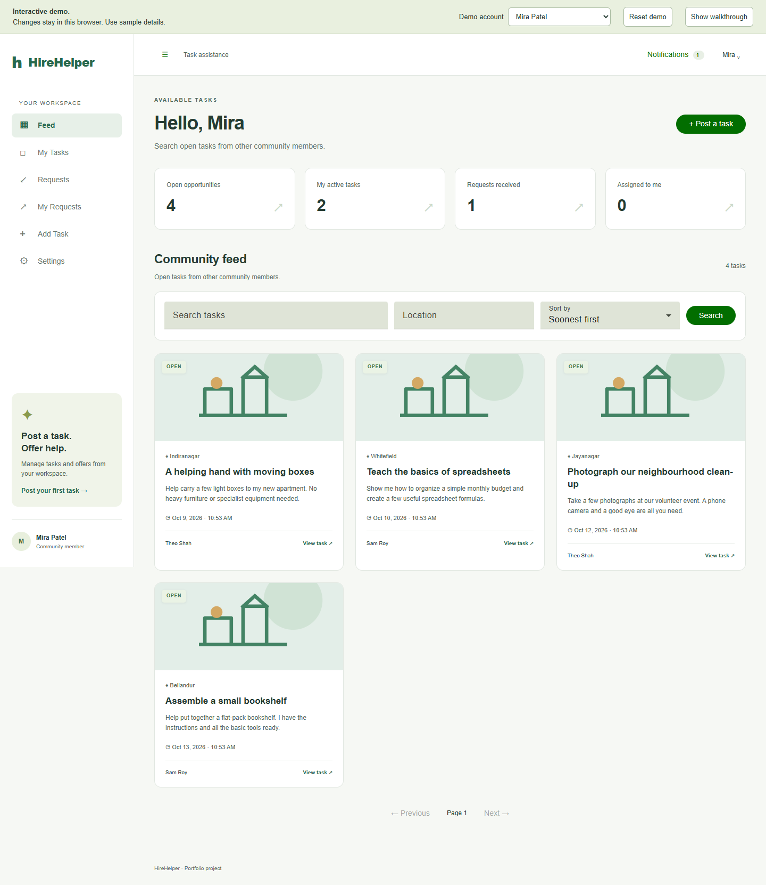

# HireHelper

HireHelper lets people post everyday tasks, offer help, select one helper and follow work through to owner-confirmed completion. Each member can both post tasks and help others.

**Live demo: deployment pending.** The repository is prepared for a free static Vercel deployment. See [publishing instructions](docs/DEPLOYMENT.md). A public URL will be added after deployment and browser verification.



[Post a task on mobile](docs/screenshots/demo-date-mobile.png)

## Try it

Install Node 24 (24.15 or later within 24.x), npm and Git. From the repository root:

```powershell
npm ci
npm run build:vercel
npm run check:vercel
npm run preview:vercel
```

Open http://localhost:4202/#/login. Choose **Try demo** to enter as Mira. Show the walkthrough, accept Theo's prepared garden offer under Requests, switch to Theo, start work and request completion, then switch to Mira to confirm. You can also post a task, search the feed, upload a local image, inspect notifications and edit a fictional profile. Reset demo restores the prepared example after confirmation.

On Post a task, use the calendar buttons to choose dates and the clock buttons to choose start/end times. Dates can also be typed as `DD/MM/YYYY` and times as `HH:mm`. Time lists use 15-minute steps; typing allows any valid minute. The device timezone is shown beside the form.

## Two modes

| | Static portfolio demo | Full application, run locally |
|---|---|---|
| Accounts | Fictional members; no credentials | Registration and mandatory email OTP |
| Data | Browser-local tasks, offers, profiles and images | PostgreSQL and disk image storage |
| Authorization | UI/domain simulation; not a security boundary | Server permissions, cookie sessions and CSRF |
| Notifications | Browser events and saved local notices | Persistent notices and authenticated SSE |
| Assignment | Simulated single helper | Transaction locks and uniqueness prevent double assignment |

The hosted demo sends no email and has no shared database or backend connections. Visitors have independent data. Vercel and Pages also have separate browser storage. Use sample details. If browser storage is unavailable, a visible memory-mode notice explains that reloading loses changes. Damaged or incompatible saved data stays untouched until you explicitly reset it. Refresh expired sample dates preserves visitor tasks and active assignments. Local images are limited to 5 MiB per input and a bounded total browser store.

The frontend uses Angular 21, Material, Reactive Forms, signals, RxJS and SCSS. The API uses NestJS 11, Prisma 7, PostgreSQL, Argon2id, Mailpit/Nodemailer and Sharp. Both modes share the screens. Build-time file replacement selects the static adapter; the normal build retains real authentication and API requests. Hash routing allows static deep-link reloads without asset catch-all rewrites.

Task lifecycle: `OPEN → ASSIGNED → IN_PROGRESS → COMPLETION_PENDING → COMPLETED`. Owners can return pending completion with a reason, or cancel before work starts. There are no payments, chat, maps or admin screens.

## Full local application

With Docker Desktop running:

```powershell
npm ci
npm run setup
docker compose up --build -d
```

Open http://localhost:4200. Registration and login OTP messages appear in the local Mailpit inbox at http://localhost:8025; they are not delivered to Gmail. API documentation is at http://localhost:4200/api/docs. Compose preserves the database, inbox and uploads in named volumes. Native development and backup instructions are in the [project guide](docs/PROJECT_GUIDE.md).

## Checks

```powershell
npm run db:generate
npm run lint
npm run typecheck
npm run build
npm test
npm audit --audit-level=high
npm run build:vercel
npm run check:vercel
npx playwright install chromium
npm run test:demo
```

Backend unit tests cover security primitives. Demo browser tests cover the production artifact, owner/helper workflow, local images, profile changes, persistence, reset, storage failure recovery, date entry and responsive layouts. Full-server browser scenarios use a separate test stack: see the guide before running `npm run test:e2e`. Hosted CI and the deployed domain need verification after publication. Vercel's automatic Git deployments are independent of GitHub Actions success unless deployment gating is explicitly configured.

## Documentation

- [Complete project flow and source map](docs/PROJECT_GUIDE.md)
- [Architecture and data model](docs/ARCHITECTURE.md)
- [GitHub upload and Vercel settings](docs/DEPLOYMENT.md)
- [Optional manual GitHub Pages deployment](docs/GITHUB_PAGES.md)
- [Contributing](CONTRIBUTING.md)

This is an independently rebuilt implementation of the brief “Internship 6.0 (B4-5) HireHelper: Development of an On-Demand Task Assistance Application”. It does not imply Infosys endorsement or ownership of teammates' work. No open-source license has been selected; public visibility alone does not grant general reuse permission.
