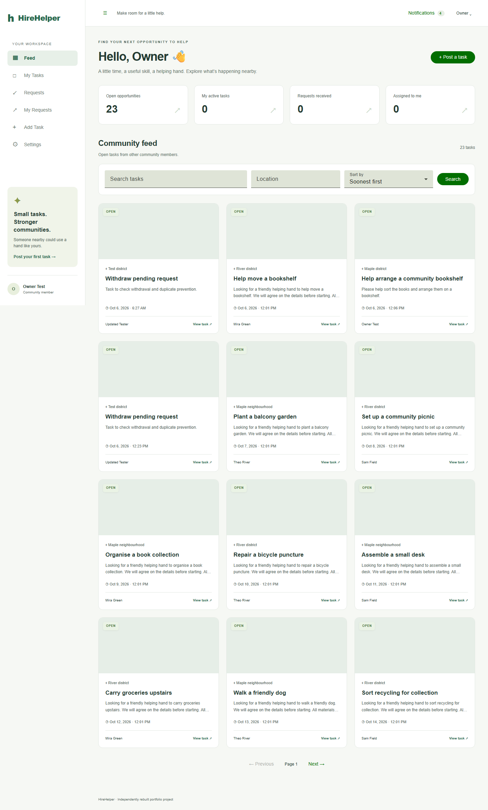

# HireHelper

An independently rebuilt Angular full-stack portfolio application: post a task, offer help, select one helper and track work to owner-confirmed completion. Every account can post and help. This project does not claim Infosys endorsement.

**Read the [complete project guide](docs/PROJECT_GUIDE.md)** for the user journey, architecture, database, security, API, local runtime, CI/CD and source-code flow.

The selected public-demo setup is **GitHub Pages**: an interactive portfolio simulation with sample accounts and browser-local data. The real NestJS/PostgreSQL backend remains available in the repository and local application. The simulation sends no OTP email and does not share tasks between visitors. See [Pages preview and publishing](docs/GITHUB_PAGES.md). A public deployment has not yet been verified.

Angular standalone components, lazy routes, Reactive Forms, HttpClient, RxJS and signals; Angular Material/SCSS; NestJS; PostgreSQL/Prisma migrations; Argon2id; Nodemailer/Mailpit; persistent local images; cookie-authenticated SSE. No external keys or accounts required locally.



Post tasks, offer help, select one helper and follow progress through owner-confirmed completion. Features include email OTP, searchable listings, image uploads, live notifications and profile settings. See the [architecture and database diagrams](docs/ARCHITECTURE.md), [mobile screenshot](docs/screenshots/feed-360.png), [contribution guide](CONTRIBUTING.md) and [VS Code publishing steps](docs/GITHUB_PUBLISHING.md).

## Start locally

Prerequisites: Node 24 LTS (24.15+), npm, Git, Docker Desktop with Compose v2 (Windows: enable WSL2 engine), or Docker Engine/Compose v2 on Linux. Use Node 24 rather than Node 23. Exact pins are in package manifests and package-lock.json.

For the browser-only Pages demo, Docker/database/email are unnecessary:

```sh
npm ci
npm run build:pages -- --base-href /hirehelper/
npm run preview:pages
```

Open http://localhost:4201/hirehelper/#/login while the preview runs. Choose Mira, Theo or Sam; use the visible sample-account selector to explore both sides of a task. Reset demo restores this browser's fictional sample data. The full application uses the separate commands below.

Commands work in Windows PowerShell and Unix shells from the project root:

```sh
npm ci
npm run setup
docker compose up --build -d
```

Open http://localhost:4200. OTP messages go to **http://localhost:8025**, the Mailpit test inbox. This captures email locally; it does not deliver to Gmail or public inboxes. API docs: http://localhost:4200/api/docs. Readiness: http://localhost:4200/api/v1/health/ready.

Compose runs migrations before starting the API and preserves PostgreSQL, inbox and uploads in named volumes. Container services use `postgres` and `mailpit` hostnames. The web server proxies `/api` to the API and serves Angular deep links. Database, SMTP, inbox and API development ports bind to loopback. Defaults: web 4200, API 3000, DB 5432, SMTP 1025, inbox 8025.

**Verification status:** source builds, strict type checks, lint and unit checks passed. Docker builds, first start with new named volumes, migrations, two real browser scenarios and actual container restart persistence passed. Browser checks covered registration/login OTP, uploads, owner/helper lifecycle, live notifications/reconnect, responsive widths, deep reloads and auth guards. Session, task, notifications, identical image bytes and inbox persisted after restart. Native concurrency/security coverage and exact results are recorded in [docs/BUILD_PROGRESS.md](docs/BUILD_PROGRESS.md). HTTPS/external SMTP production deployment remains unverified.

Windows helpers: run `powershell -ExecutionPolicy Bypass -File .\scripts\install-windows-prerequisites.ps1` from an administrator PowerShell to download verified official Node 24 and WSL installers and enable required Windows features. It never restarts Windows automatically. After restarting Windows and opening Docker Desktop, run `powershell -ExecutionPolicy Bypass -File .\scripts\start-windows.ps1`. This handles Docker's per-user install location even when Docker is absent from PATH. Both helper scripts currently have syntax validation only; administrator installation and Compose startup are pending.

The optional native preview uses **http://localhost:4200** and the OTP inbox **http://localhost:58025**. Port 8025 is for Compose only. The native preview uses the preserved isolated test database, separate from `.env` and development volumes. Recheck services after changing accounts or restarting Windows; run either the native API/web or Compose to avoid port conflicts.

## Native development

```sh
npm ci
npm run setup
docker compose up -d postgres mailpit
npm run db:generate
npm run db:migrate
npm run dev:api
```

In a second terminal:

```sh
npm run dev:web
```

Keep `.env` in the repository root. Native services use localhost; the CLI reads root configuration. The API dev runner compiles TypeScript before launching to retain Nest decorator metadata. Angular proxies `/api`, including cookie-authenticated SSE. Use http://localhost:4200 consistently rather than mixing localhost and 127.0.0.1.

## Configuration and credentials

`npm run setup` creates ignored `.env` only when absent, generates random DB/session/OTP secrets and preserves existing configuration. Do not enter backend secrets into Angular files. The `.env.example` placeholders cannot run as secrets.

| Variable                    | Local value/purpose                                                          |
| --------------------------- | ---------------------------------------------------------------------------- |
| NODE_ENV                    | development; production enables stricter validation                          |
| APP_ORIGIN                  | http://localhost:4200; exact scheme/host/port used for CSRF                  |
| API_PORT                    | 3000                                                                         |
| POSTGRES_USER / POSTGRES_DB | hirehelper; compose DB configuration                                         |
| POSTGRES_PASSWORD           | generated random password; preserve with existing DB volume                  |
| DATABASE_URL                | generated native PostgreSQL URL; Compose overrides hostname                  |
| SESSION_SECRET              | generated HMAC key for session and CSRF hashes                               |
| OTP_SECRET                  | separate generated HMAC key for OTP challenges                               |
| SMTP_HOST / SMTP_PORT       | localhost / 1025 native, mailpit / 1025 container                            |
| SMTP_SECURE                 | false for Mailpit; true for implicit TLS (usually 465)                       |
| SMTP_USER / SMTP_PASSWORD   | blank locally; optional real SMTP credentials/app password                   |
| SMTP_FROM                   | HireHelper <no-reply@hirehelper.test> locally; verified sender for real SMTP |
| UPLOAD_DIR                  | ./uploads native or persistent /data/uploads in Compose                      |
| COOKIE_SECURE               | false locally over HTTP; true for HTTPS production                           |
| DEMO_SEED                   | false by default; true explicitly for development demo only                  |

For real SMTP obtain the host, port, TLS settings, username, password/app password and sender address from your mail provider. Enter them in backend `.env`; costs depend on the provider. No real SMTP credentials are needed for development. Production requires real SMTP (STARTTLS enforced unless implicit TLS), HTTPS origin, secure cookies and disabled seeding. Verify the SMTP connection at startup. Mailpit must be disabled in any production Compose configuration.

## Demo walkthrough

Set `DEMO_SEED=true` in ignored `.env`, then:

```sh
# Full Compose API:
docker compose exec api npm run seed
# Or native API:
npm run seed
```

Development-only fictional users: `mira@hirehelper.test`, `theo@hirehelper.test`, `sam@hirehelper.test`; password `Demo-Helper-2026!`. Seed is opt-in and idempotent: existing records are preserved. Dates are relative to first seeding; after a long interval create new future tasks. Demo login still requires OTP, found in Mailpit.

1. Register or sign in, then enter the emailed six-digit code.
2. Browse/search/filter Feed. Post a future task with an optional picture.
3. In a separate browser profile/private window sign in as another user, open the task and offer help.
4. As owner open **Requests** and accept. Other pending requests become rejected.
5. As helper open **My Requests**, view assigned task, start work and request completion.
6. Owner confirms completion or returns it to progress with a reason. Notifications persist and update live.
7. Settings supports profile/avatar, password changes and new-email verification. Contact details appear only to owner/selected helper after assignment.

Tasks with requests cannot be edited or deleted; cancellation retains history. Cancellation ends after work starts. Rejected/withdrawn requests cannot be resubmitted. No payments, maps, chat, reassignment or social login.

## Checks and isolated testing

```sh
npm run lint
npm run typecheck
npm run build
npm test
docker compose -p hirehelper-tests -f compose.test.yaml up -d
node scripts/test-stack.mjs
```

GitHub Actions runs dependency installation, Prisma generation, lint, type checking, both production builds and unit/security checks on pushes to main and pull requests. The workflow is configured in `.github/workflows/ci.yml`; its first hosted execution requires publishing the repository. Browser/Docker acceptance remains a separate check described below.

In separate terminals run `npm run dev:web`, then `npx playwright install chromium` and `npx playwright test`. The test stack uses `hirehelper_test` on 55432, Mailpit SMTP 51025/inbox 58025, and ignored `.tools/test-uploads`; invoking the test stack explicitly seeds fictional test fixtures. Stop the development API before launching the test API (both use 3000); stop development web if 4200 is busy. Test secrets are randomly generated per test API launch. Tests never obtain codes from production auth APIs; they read Mailpit's testing API. API acceptance tests manipulate expiry/cooldown fields only in the isolated test DB. Do not run tests against a production deployment.

On this Windows build host, ignored local runtime binaries enabled tests without Docker. `scripts/local-test-services.mjs` is an optional developer utility requiring `.tools/node_modules/embedded-postgres` 17.6.0-beta.15 and `.tools/mailpit/mailpit.exe` v1.27.8; it is not a production dependency or a substitute for Compose validation. Normal users should use the Compose test services.

## Persistence, backup and reset

`docker compose down` preserves data; `docker compose up -d` reuses volumes. Back up both the database and uploaded images. For a binary PostgreSQL dump avoid PowerShell 5 native-output redirection; write inside the container and copy:

```sh
docker compose exec postgres sh -c 'pg_dump -U "$POSTGRES_USER" -d "$POSTGRES_DB" -Fc -f /tmp/hirehelper.dump'
docker compose cp postgres:/tmp/hirehelper.dump ./hirehelper.dump
docker compose cp api:/data/uploads ./uploads-backup
```

Restore only into a prepared target database after inspecting its existing contents. Use `pg_restore` with the matching database credentials and restore the image directory too. Keep backups private; they contain account/contact data. Rotate session/OTP secrets to invalidate outstanding credentials after a security incident.

Destructive reset is explicit and guarded:

```sh
node scripts/reset.mjs
# Prints warning and does nothing. After backup, explicitly confirm:
node scripts/reset.mjs --confirm-delete-local-data
```

This deletes Compose volumes for DB, inbox and uploads. It never runs automatically. Test service volumes belong to the distinct `hirehelper-tests` project. Backup dumps are ignored by Git.

For native upload maintenance run `node scripts/cleanup-uploads.mjs` with the matching `.env`/UPLOAD_DIR. It removes only database-confirmed unattached uploads older than 24 hours, using row locks shared with attachment operations. Attached task pictures and avatars are preserved. Schedule maintenance explicitly after backing up; it is not a task deletion/reset operation.

## Troubleshooting

- Occupied ports: Windows `Get-NetTCPConnection -LocalPort 4200,3000,5432,8025`; Unix `ss -ltn`. Stop the identified service you own or adjust compose mappings and APP_ORIGIN/proxy/SMTP/DATABASE_URL consistently.
- Docker/WSL: run `docker version` and `docker compose version`, start Docker Desktop and enable its WSL2 engine. If no docker executable is installed, Compose cannot run.
- DB/migration: `docker compose logs postgres api`. Preserve the password used to initialize existing volumes. Readiness failure means DB access is unavailable. Run `npm run db:generate` after schema changes and `npm run db:migrate` against the correct DB.
- Cookies/403: use the same localhost origin, obtain a CSRF cookie via initial page load, and keep APP_ORIGIN exact. Secure cookies require HTTPS; local HTTP uses COOKIE_SECURE=false.
- SMTP: check Mailpit logs and ports. It captures local messages only. External SMTP may require app passwords, verified senders and TLS. OTPs expire after five minutes; wait 60 seconds before resend.
- Uploads: ensure UPLOAD_DIR is writable and persistent. Static JPEG/PNG/WebP up to 5 MiB are decoded and re-encoded to WebP; SVG, malformed/animated files and huge decoded images are rejected.
- Browser/API connectivity: check `/api/v1/health/ready`, API logs and same-origin proxy. Session expiry requires signing in again.

Architecture, database diagram, lifecycle, security and endpoints: [docs/ARCHITECTURE.md](docs/ARCHITECTURE.md). Interview explanation and factual resume templates: [docs/PORTFOLIO.md](docs/PORTFOLIO.md). Recovery: [CODEX_PROGRESS.md](CODEX_PROGRESS.md), [TODO.md](TODO.md), Git history.
