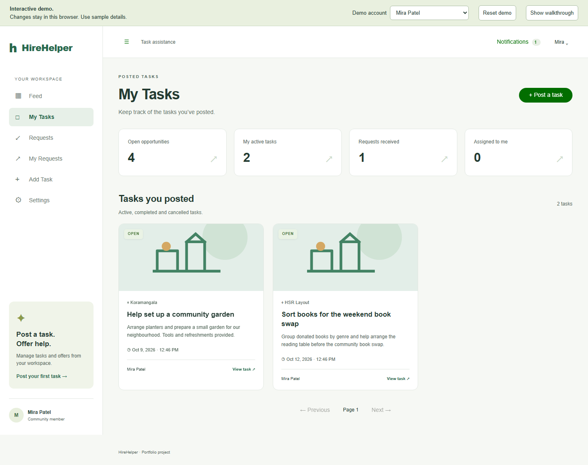
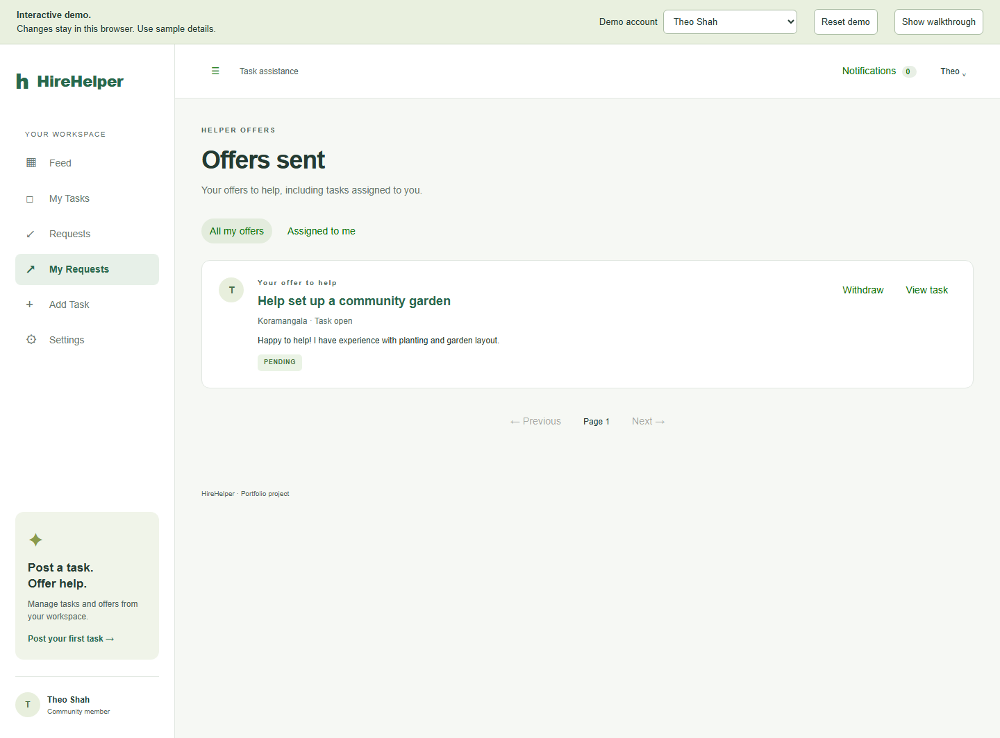
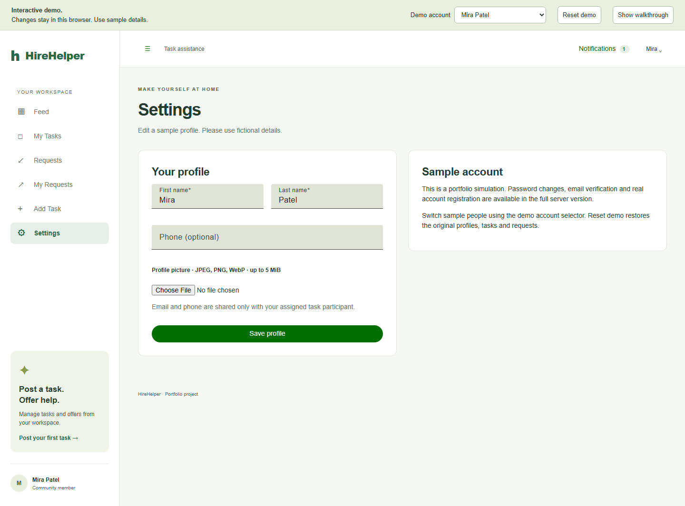
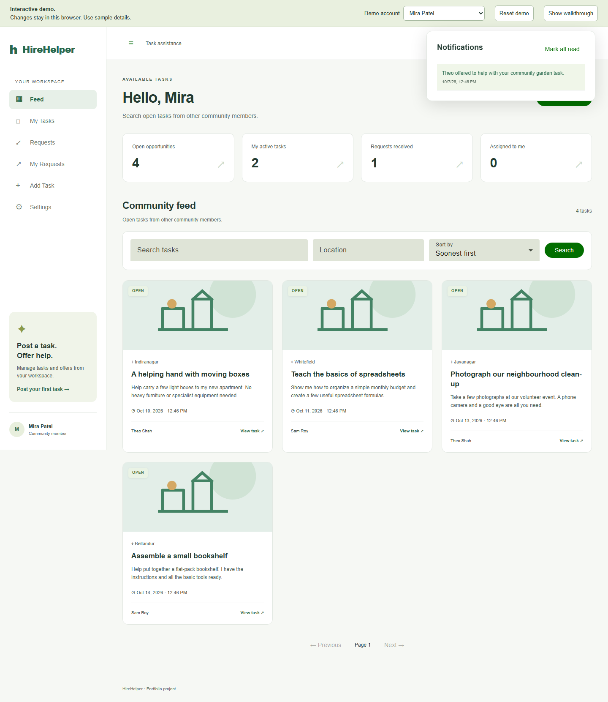

# HireHelper

**An on-demand help marketplace for everyday tasks.** Neighbours post a task, offer to help, and follow the work through to owner-confirmed completion.

**Live demo:** [**bytesbysuyash.github.io/HireHelper/**](https://bytesbysuyash.github.io/HireHelper/)

## Screens from the demo

The screens below show the main owner and helper workflows at desktop size. Names, tasks, and activity are fictional sample data.

<table>
  <tr>
    <th>Community feed</th>
    <th>Task details and offer to help</th>
  </tr>
  <tr>
    <td></td>
    <td></td>
  </tr>
  <tr>
    <th>Requests received</th>
    <th>Create a task</th>
  </tr>
  <tr>
    <td></td>
    <td></td>
  </tr>
  <tr>
    <th>My tasks</th>
    <th>Offers sent</th>
  </tr>
  <tr>
    <td></td>
    <td></td>
  </tr>
  <tr>
    <th>Profile settings</th>
    <th>Notifications</th>
  </tr>
  <tr>
    <td></td>
    <td></td>
  </tr>
</table>

## Take a quick tour

1. Open the live demo and choose **Explore as Mira**.
2. Browse the feed, search by task or location, and open a listing to see its details.
3. In **Requests**, accept Theo's offer on Mira's community garden task.
4. Switch the demo account to Theo. Open **My Requests**, start the task, and request completion.
5. Switch back to Mira and confirm the completed work.

You can also create a task, send an offer from another sample account, review notifications, and edit a fictional profile. Use **Reset demo** to restore the prepared walkthrough. Changes are stored in your browser and are not shared with other visitors.

## What the project demonstrates

- **A complete task workflow:** task creation, discovery, help requests, one-helper assignment, work in progress, and owner-confirmed completion.
- **Two-sided participation:** each member can post tasks and help other members; roles depend on the task, not the account.
- **Thoughtful product details:** task search, location filters, scheduling, optional images, profile settings, notifications, and responsive layouts.
- **A real full-stack implementation:** Angular and NestJS with PostgreSQL and Prisma, alongside a separate static demo for portfolio review.

The public demo uses fictional accounts and browser-local sample data. It does not create real accounts or send email. The repository also contains the full API implementation; the security and persistence details below describe that codebase, not the static demo.

## Engineering highlights

- Passwords are hashed with Argon2id. Email verification codes are single-use, purpose-bound, rate-limited, and stored as keyed hashes.
- Revocable server-side cookie sessions, CSRF tokens, origin checks, and API-side authorization protect account and task operations.
- Database constraints and a transaction ensure a task can be assigned to one helper even when requests race.
- Notifications persist in PostgreSQL; authenticated server-sent events refresh the interface.
- Uploaded images are checked and re-encoded before storage.

## Technology

| Area | Stack |
| --- | --- |
| Web | Angular 21, TypeScript, Angular Material, RxJS, SCSS |
| API | NestJS 11, TypeScript, Prisma 7 |
| Data | PostgreSQL |
| Security and media | Argon2id, email OTP, cookie sessions, CSRF, Sharp |
| Demo delivery | GitHub Pages static build with hash-based routing |

## Project notes

- [Architecture and data model](docs/ARCHITECTURE.md)
- [Project guide and source map](docs/PROJECT_GUIDE.md)
- [Contributing](CONTRIBUTING.md)

This is an independently rebuilt implementation of the brief "Internship 6.0 (B4-5) HireHelper: Development of an On-Demand Task Assistance Application." It does not imply Infosys endorsement or ownership of teammates' work. No open-source license has been selected; public visibility alone does not grant general reuse permission.
