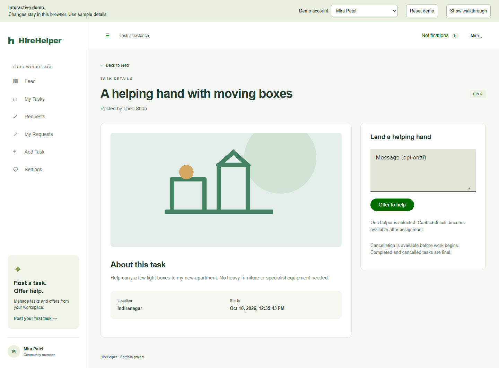
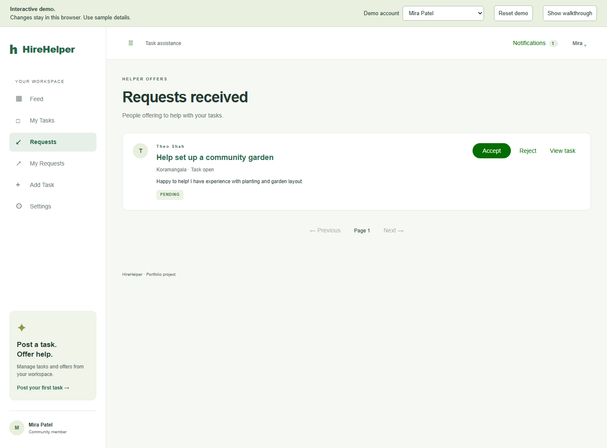
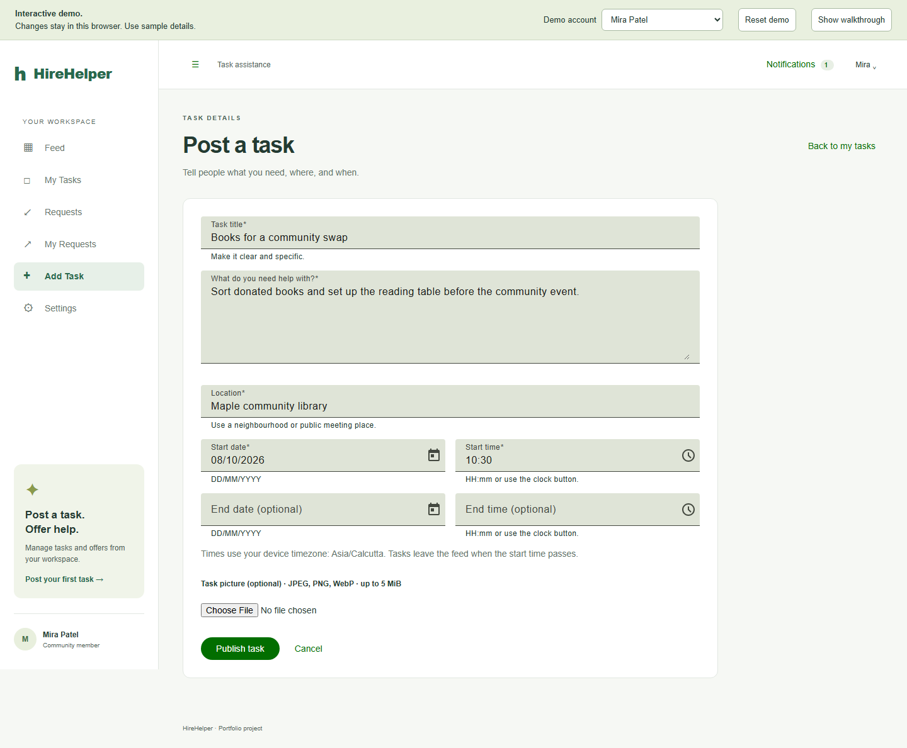

# HireHelper

**A full stack marketplace for everyday tasks and neighborly help.** Members can post a task, offer to help with someone else’s task, and follow an agreed handoff through owner-confirmed completion.

> The hosted portfolio demo is not published yet. The static demo runs locally with fictional sample data; the full application runs locally with its API and database.

## Desktop screens from the demo

These screenshots show the app at desktop size. Names and tasks are fictional sample data.

<table>
  <tr>
    <th>Community task feed</th>
    <th>Task detail</th>
  </tr>
  <tr>
    <td></td>
    <td></td>
  </tr>
  <tr>
    <th>Requests received</th>
    <th>Create a task</th>
  </tr>
  <tr>
    <td></td>
    <td></td>
  </tr>
</table>

The demo includes a guided owner/helper walkthrough, task search, requests, notifications, profile editing and browser-local image uploads. **Try demo** opens as Mira. Accept Theo’s prepared offer from **Requests**, switch to Theo to start the task and request completion, then switch back to Mira to confirm it. Sample changes stay in the current browser and can be reset from the demo banner.

## What it demonstrates

- **Task marketplace:** create and discover tasks, filter by text and location, and send or manage help requests.
- **Clear task lifecycle:** `OPEN → ASSIGNED → IN_PROGRESS → COMPLETION_PENDING → COMPLETED`, with owner review before completion.
- **Server-side safeguards:** authenticated sessions, OTP challenges, CSRF and origin checks, ownership checks, and database constraints for one-helper assignment.
- **Persistent updates:** notifications and authenticated server-sent events in the full application.
- **Responsive interface:** Angular, Material, Reactive Forms, signals and SCSS across desktop and mobile layouts.
- **Two runnable modes:** a static browser demo for portfolio review and a full local stack using NestJS, Prisma and PostgreSQL.

## Run the static demo

Requires Node.js 24.15 or later in the 24.x line, npm and Git. From the repository root:

```powershell
npm ci
npm run build:vercel
npm run check:vercel
npm run preview:vercel
```

Open <http://localhost:4202/#/login> and choose **Try demo**. The demo uses fictional users and browser storage only; it has no backend, shared database or email delivery. If browser storage is unavailable, it switches to temporary in-memory data and shows a notice.

## Run the full application

Requires Docker Desktop. From the repository root:

```powershell
npm ci
npm run setup
docker compose up --build -d
```

Open <http://localhost:4200>. Registration and sign-in codes appear in the local Mailpit inbox at <http://localhost:8025>; they are not sent to a real email address. API documentation is available at <http://localhost:4200/api/docs>. Compose stores the database, inbox and uploads in named volumes.

## Technology

| Area | Stack |
| --- | --- |
| Web | Angular 21, TypeScript, Angular Material, RxJS, SCSS |
| API | NestJS 11, TypeScript, Prisma 7 |
| Data | PostgreSQL |
| Authentication | Argon2id password hashing, email OTP, revocable cookie sessions, CSRF protection |
| Media and updates | Sanitized image processing with Sharp; persisted notifications and authenticated SSE |
| Delivery | Docker Compose locally; static demo build for Vercel or optional GitHub Pages |

The hosted demo is a portfolio preview, not a production service. It does not process real accounts, email or shared data. The full app is configured for local development; public full-stack hosting requires separately operated API, database, persistent file storage, HTTPS and email delivery.

## Project checks

```powershell
npm run db:generate
npm run lint
npm run typecheck
npm run build
npm test
npm run build:vercel
npm run check:vercel
npm run test:demo
```

Backend unit tests cover security primitives. Browser scenarios cover the static demo, and full-server scenarios use an isolated test stack. See the [project guide](docs/PROJECT_GUIDE.md) for the test setup and scope.

## Project notes

- [Architecture and data model](docs/ARCHITECTURE.md)
- [Project guide and source map](docs/PROJECT_GUIDE.md)
- [Deployment instructions](docs/DEPLOYMENT.md)
- [Contributing](CONTRIBUTING.md)

This is an independently rebuilt implementation of the brief “Internship 6.0 (B4-5) HireHelper: Development of an On-Demand Task Assistance Application.” It does not imply Infosys endorsement or ownership of teammates’ work. No open-source license has been selected; public visibility alone does not grant general reuse permission.
