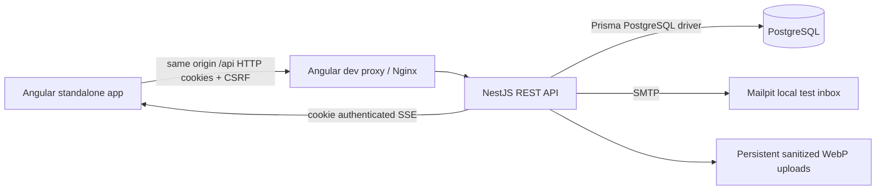
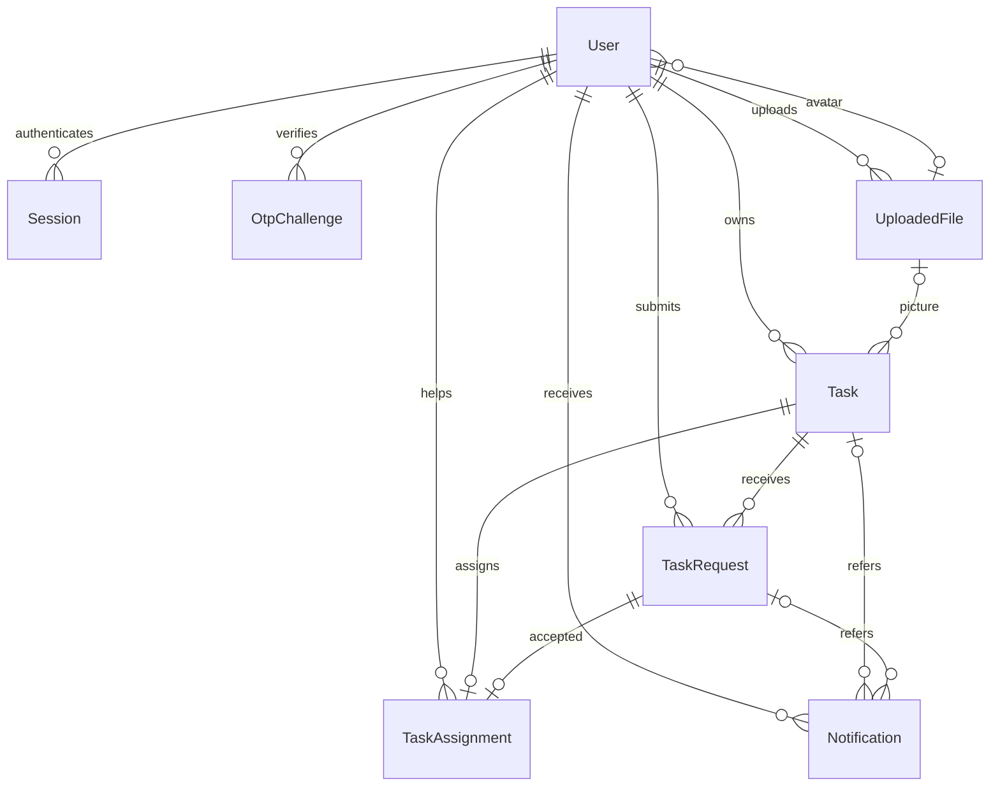
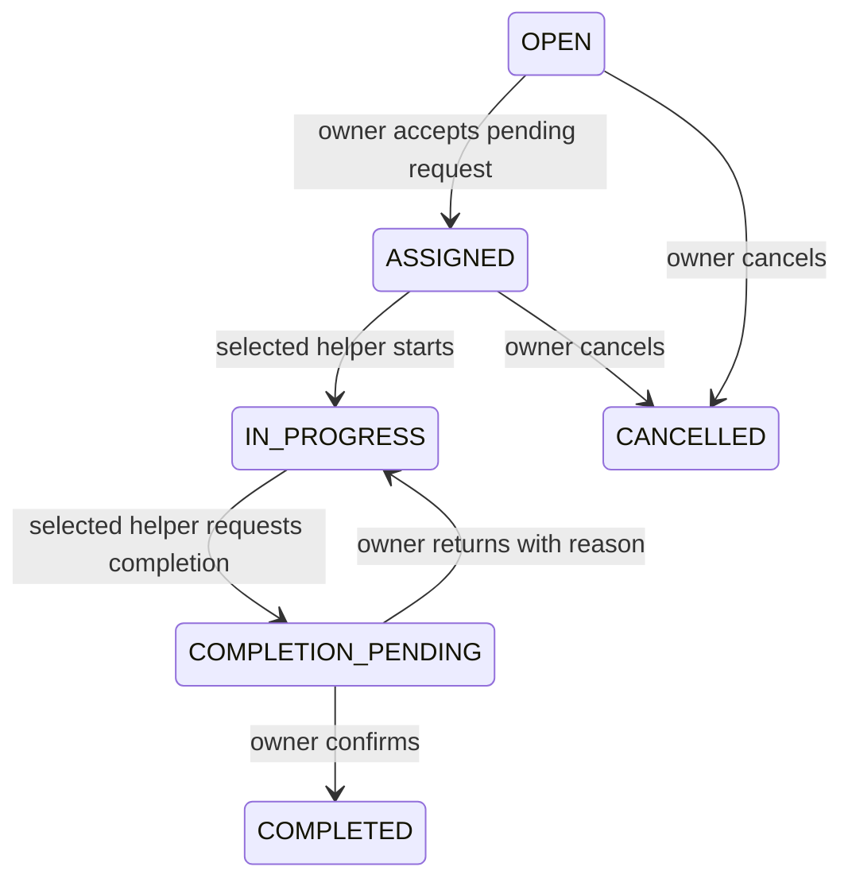

# Architecture and domain

This document describes the **full NestJS/PostgreSQL application**. The selected GitHub Pages demo uses the same frontend with a browser-local simulation; its authentication, persistence and notifications are different. Read the [complete project guide](PROJECT_GUIDE.md) for both modes and their pipelines, and the [Pages publishing guide](GITHUB_PAGES.md) for the current public-demo setup.

Pin choices: Angular 21 LTS supports TypeScript 5.9 and Node 24 per [official matrix](https://angular.dev/reference/versions). Angular packages use one framework major; Material/CDK/CLI use that major's current patch. Nest 11 stays on its stable supported major and avoids a premature TypeScript 6 migration. Prisma 7.10 uses [Prisma config and PostgreSQL driver adapter](https://www.prisma.io/docs/guides/upgrade-prisma-orm/v7), with no obsolete datasource URL in the schema. Node 24.15 is supported across these packages. Exact pins and lockfile govern reproducible installation.

All keys are UUIDs, emails are normalized/unique, task/requester pairs and task assignments have unique constraints. Foreign keys restrict deletion of domain history; optional image references become null on file deletion. DateTime columns use PostgreSQL timestamptz(3); API/seed/maintenance connections explicitly set timezone=UTC for reliable driver parsing and comparisons on non-UTC native databases. Angular DatePipe displays device-local time; native datetime-local inputs convert to UTC ISO strings before submission.

Requests: PENDING → ACCEPTED / REJECTED / WITHDRAWN. Accepted records remain historical when assignments complete/cancel. One assignment per task; no reassignment. Reject/withdraw blocks resubmission. Feed includes other users' OPEN tasks whose start time is still in the future. Detail remains visible to participants/requesters after feed removal; contact information is restricted to owner and selected helper.

Every task mutation locks the task row with `SELECT ... FOR UPDATE` inside a READ COMMITTED transaction. This includes submitting requests, accepting/rejecting/withdrawing, lifecycle, editing and deleting. A waiting acceptance sees the committed ASSIGNED state and returns 409. The unique assignment constraint is a second integrity boundary. Acceptance changes task/request states, creates assignment, rejects competitors and persists notifications atomically. Cancellation closes pending requests and cancels any assignment. No cancellation once work begins; editing/deletion requires OPEN with no requests.

Notifications are written in the business transaction, then recipient-specific refresh events publish after commit. EventSource uses same-origin cookies and no query token. Heartbeats every 15 seconds, logout closes its stream, and server session rechecks close revoked/expired streams within 15 seconds. Client fetches current list/counts on initial connection/reconnect. This single API process does not claim real-time fanout across multiple instances. Persistence is the source of truth if a process stops between commit and publish.

## API reference

Base `/api/v1`; Swagger UI `/api/docs`, JSON `/api/docs-json`. JSON error envelope: `{ "error": { "status": 409, "message": "..." } }`; validation messages may be arrays. 400 invalid input, 401 no authenticated session, 403 forbidden origin/ownership, 404 unavailable private resource, 409 duplicate/state conflict, 429 limits, 503 service readiness/email failure.

| Method        | Path                                             | Purpose                                                            |
| ------------- | ------------------------------------------------ | ------------------------------------------------------------------ |
| GET           | /auth/csrf                                       | Signed CSRF cookie/token bootstrap                                 |
| POST          | /auth/register                                   | Names/email/password/confirmation/optional phone; registration OTP |
| POST          | /auth/login                                      | Password validation followed by OTP; no session yet                |
| POST          | /auth/forgot                                     | Purpose-bound reset OTP; generic eligible response                 |
| POST          | /auth/resend                                     | challengeId; 60-second cooldown, invalidates old code              |
| POST          | /auth/verify                                     | challengeId + six-digit code; session or reset authorization       |
| POST          | /auth/reset                                      | authorization + new password; revokes sessions/challenges          |
| GET           | /auth/me                                         | Current private account DTO                                        |
| POST          | /auth/logout                                     | Revoke current session and close events                            |
| POST          | /auth/profile                                    | firstName/lastName/optional phone/avatarId                         |
| POST          | /auth/password                                   | currentPassword + new password; signs out sessions                 |
| POST          | /auth/email                                      | email/currentPassword; new address OTP, old email retained         |
| GET           | /dashboard                                       | Real open/owned/received/assigned counts                           |
| GET           | /tasks                                           | page/limit/search/location/sort=soonest or newest                  |
| GET           | /tasks/mine                                      | Paginated owner tasks across all states                            |
| GET           | /tasks/:id                                       | Public identity + participant-specific contacts/request            |
| POST          | /tasks                                           | title/description/location/startAt/optional endAt/imageId          |
| PATCH, DELETE | /tasks/:id                                       | Owner-only OPEN with no request history                            |
| POST          | /tasks/:id/requests                              | Optional message; identity from session                            |
| GET           | /requests/received, /requests/sent               | Owner incoming versus helper outgoing                              |
| POST          | /requests/:id/accept, /reject, /withdraw         | Authorized pending request actions                                 |
| POST          | /tasks/:id/start, /complete-request              | Selected helper lifecycle                                          |
| POST          | /tasks/:id/confirm, /return, /cancel             | Owner lifecycle; return requires reason                            |
| POST          | /files?use=TASK or AVATAR                        | Multipart file, max 5 MiB                                          |
| GET           | /files/:id                                       | Sanitized attached image; unattached requires owner                |
| GET           | /notifications, /notifications/unread            | Recipient-only paginated list/count                                |
| POST          | /notifications/:id/read, /notifications/read-all | Recipient-scoped updates                                           |
| GET           | /notifications/events                            | Authenticated SSE                                                  |
| GET           | /health, /health/ready                           | Liveness / database readiness                                      |

Page defaults 1/12; maximum size 50, page 10000. Inputs use class-validator; unknown fields are rejected. UUID routes are validated before queries. Never accept a userId override. Public DTOs contain id/name/avatar only; no passwordHash, private email/phone, OTP or session hashes.

## Security choices

Dependency audit patches: mail/image/upload/Swagger packages updated to patched releases. Root overrides pin patched transitive Piscina, deepmerge-ts, mysql2 (Prisma CLI dependency), YAML, lodash and path-to-regexp. These overrides preserve Angular 21 and Prisma 7 majors; schema generation, builds and integration checks verify compatibility. Review/remove overrides when upstream packages incorporate fixes. An npm audit snapshot is a known-advisory check, not a guarantee of absence of vulnerabilities.

- Argon2id passwords; minimum 12/max 128 characters. Cryptographic six-digit OTPs hashed with a separate HMAC key bound to challenge/purpose/user. Five-minute expiration, five verification attempts, 60-second resend, database-backed IP/account limits. Atomic locked one-time consumption.
- Seven-day opaque random sessions, stored only as keyed hashes; HttpOnly SameSite=Lax cookie, Secure under HTTPS. Session rotation after successful verification. Reset grants a ten-minute single-use password-reset authorization and never a login session. Reset/password changes revoke sessions and outstanding challenges.
- Signed double-submit CSRF token plus exact origin validation on all mutations, including authentication. Backend guards authorize every private operation. Angular guards assist navigation only.
- JPEG/PNG/WebP decoding, pixel limit and static-image enforcement, metadata stripped by WebP re-encoding. Generated filenames outside source tree; owner-checked attachment. Attached sanitized images/avatars intentionally public by UUID; bytes never reveal storage paths. Unattached images are private.
- HTTPS production config requires secure cookies, real SMTP and no demo seed. SMTP connection verification before accepting real users. No secrets in frontend or tracked .env.

## Optional deployment checklist

Supply a supported Node/PostgreSQL host and persistent DB/upload storage; hosting may cost money. Configure HTTPS same-origin proxy, APP_ORIGIN, secure cookies, strong secrets, real verified SMTP sender/credentials, backups/restoration and monitoring. Remove Mailpit/dev ports/demo accounts and disable DEMO_SEED. Execute migrations and the full acceptance suite against staging; check image permissions, health, SSE buffering/timeouts and deep-link routing. A second API instance needs shared SSE delivery (not implemented). This project does not publish accounts or infrastructure automatically.
