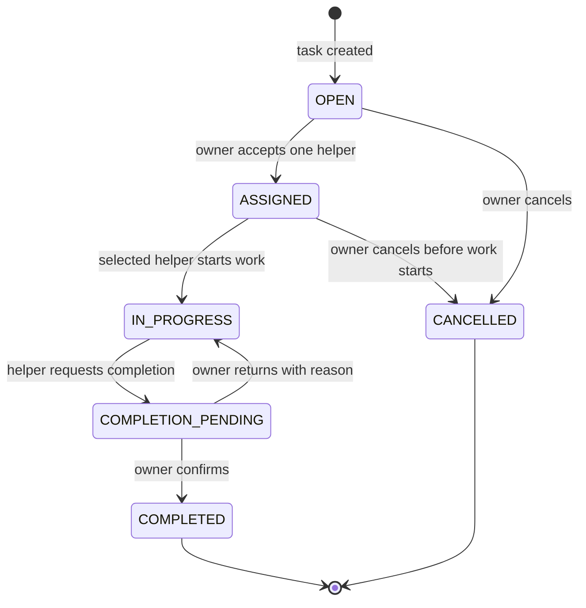
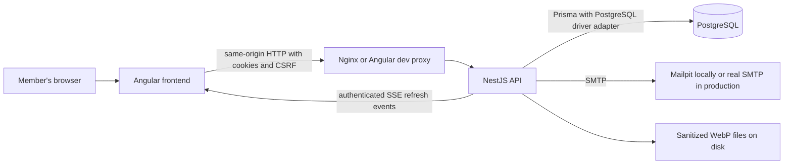
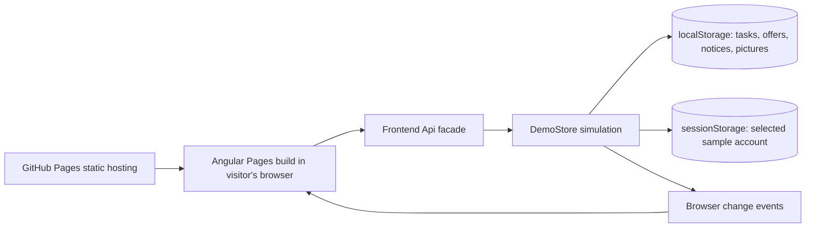
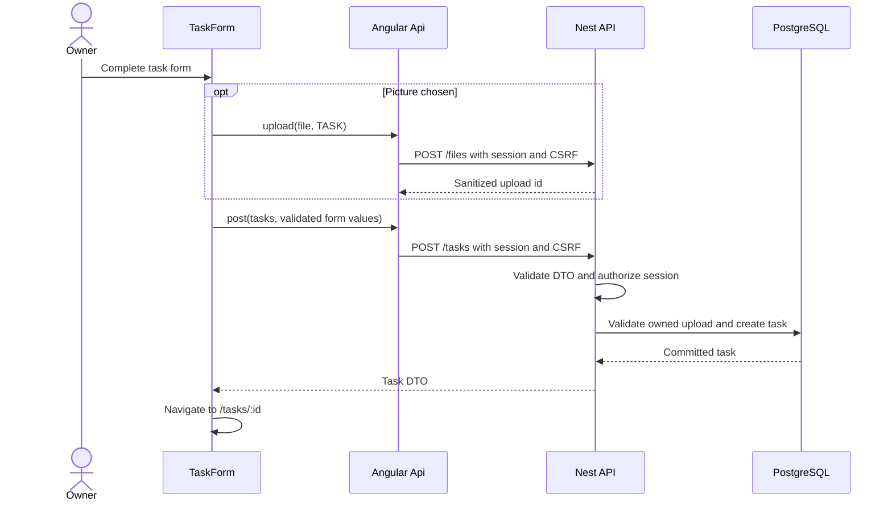
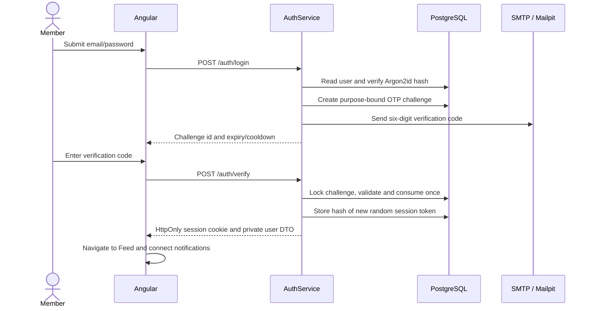
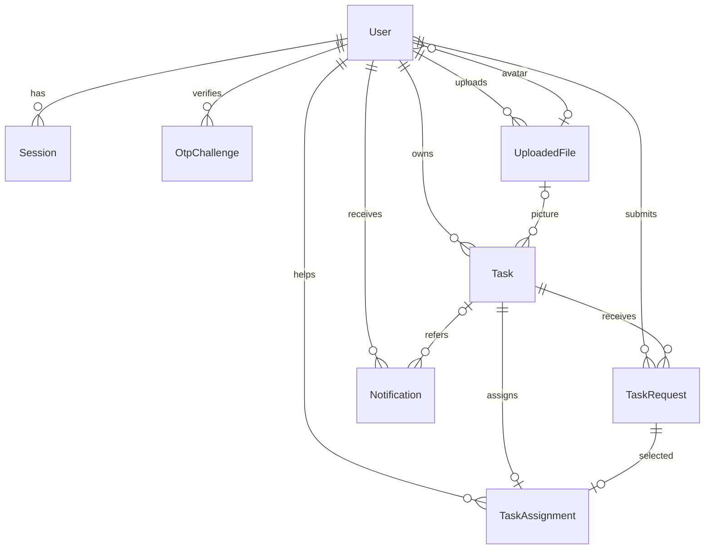
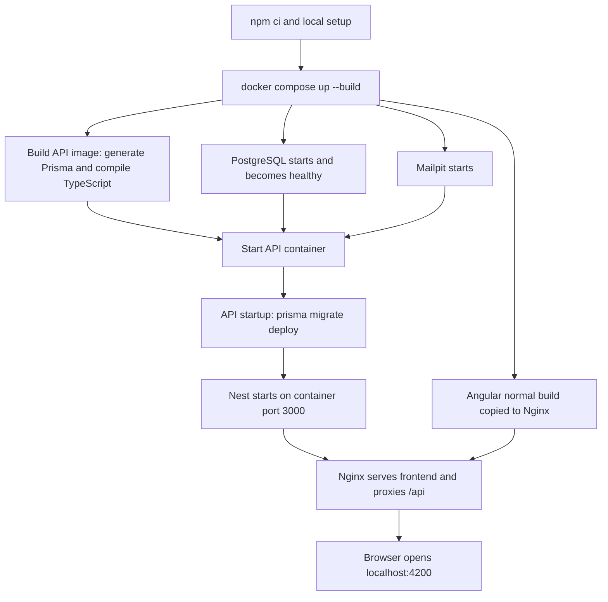
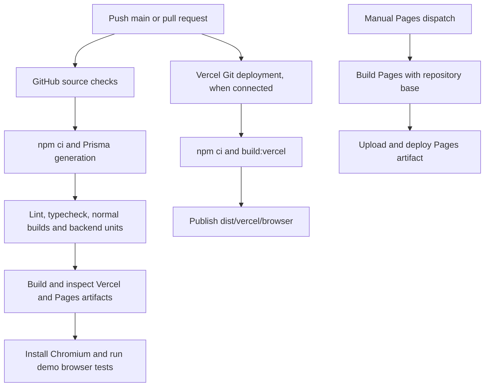

# HireHelper — complete project guide

Current deployment update: **Vercel is the primary static demo target; Pages is optional and manual.** See [DEPLOYMENT.md](DEPLOYMENT.md) for exact settings. Both use the browser adapter and hash routes; the full backend remains local. CI now builds both static targets and tests the Vercel artifact. Date entry uses separate calendars and visible Material clock pickers. Demo recovery preserves unreadable saved data until explicit reset, labels memory fallback, and offers explicit refresh of expired open sample dates. Older Pages-specific descriptions below describe that secondary target.

Documentation reviewed against the current source on **6 October 2026**.

HireHelper is a neighbourhood task marketplace. Someone posts a task, other members offer to help, the owner chooses one helper, and both follow the work through to owner-confirmed completion. The same account can post tasks and help with other people's tasks; there are no permanent owner/helper account roles.

The repository contains a **full-stack application** and a **static portfolio demo for Vercel and Pages**. They share the Angular screens but use different data and authentication implementations. The Pages link is an interactive simulation, while the full application implements the real server-side workflows.

## Contents

1. [Current project status](#1-current-project-status)
2. [Features and scope](#2-features-and-scope)
3. [User journey and task lifecycle](#3-user-journey-and-task-lifecycle)
4. [Architecture and technology](#4-architecture-and-technology)
5. [Repository and source-code map](#5-repository-and-source-code-map)
6. [Frontend startup and request flow](#6-frontend-startup-and-request-flow)
7. [Authentication and account security](#7-authentication-and-account-security)
8. [Task assignment and concurrency](#8-task-assignment-and-concurrency)
9. [Images and privacy](#9-images-and-privacy)
10. [Notifications and reconnects](#10-notifications-and-reconnects)
11. [Database model and migrations](#11-database-model-and-migrations)
12. [API reference and validation](#12-api-reference-and-validation)
13. [How the Pages demo works](#13-how-the-pages-demo-works)
14. [Local runtime and Docker pipeline](#14-local-runtime-and-docker-pipeline)
15. [GitHub CI and deployment pipeline](#15-github-ci-and-deployment-pipeline)
16. [Configuration and secrets](#16-configuration-and-secrets)
17. [Testing and evidence](#17-testing-and-evidence)
18. [Persistence, backups and troubleshooting](#18-persistence-backups-and-troubleshooting)
19. [Maintenance and future extensions](#19-maintenance-and-future-extensions)
20. [Explaining the project in an interview](#20-explaining-the-project-in-an-interview)

## 1. Current project status

| Area | Current state |
|---|---|
| Full application | Implemented and previously validated locally with native services and Docker Compose |
| Static demo | Vercel and optional Pages targets implemented; production browser checks passed locally |
| Backend during static demo use | Not contacted; no API/database/email service is required |
| Public repository | Intended owner is `BytesBySuyash`, intended repository is public `hirehelper`; this checkout has no Git remote configured at this review |
| Public demo deployment | Vercel configuration and manual Pages workflow exist; no hosted deployment or live URL has been verified |
| Intended Pages URL | `https://bytesbysuyash.github.io/hirehelper/` after publishing and successful deployment; this is an expected address, not evidence of a live site |
| Local Vercel preview | `http://localhost:4202/#/login` while the preview server is running |
| Local Pages preview | `http://localhost:4201/hirehelper/#/login` while the preview server is running |
| Local full application | `http://localhost:4200` while Compose or the native application is running |
| License | Not selected by the owner yet |
| Demo video | Planned for later |

Current public-demo direction is **Vercel static demo, with optional manual Pages**. The full application remains a separate local runtime.

## 2. Features and scope

| Feature | Full application | Pages demo |
|---|---|---|
| Entry/sign-in | Email/password plus mandatory OTP | Choose Mira, Theo or Sam; no password |
| Registration/reset/email changes | Implemented with purpose-bound OTP flows | Not performed; demo entry replaces authentication screens |
| Feed | Shared database listings, search, location filter, sorting and pagination | Equivalent interactions over this browser's sample data |
| Post/edit/delete tasks | Server-authorized actions with validation | Browser-local simulation of task rules |
| Help offers | Submit, accept, reject, withdraw | Simulated with sample accounts |
| Assignment and completion | Real database transaction and one-helper constraint | Browser-local lifecycle simulation |
| Pictures/avatars | Sharp-sanitized WebP files on persistent disk | Canvas-generated image data stored in browser storage |
| Notifications | PostgreSQL history plus authenticated SSE refresh | Browser-local history plus browser events |
| Profile changes | Saved to the real account | Saved to a fictional sample profile locally |
| Persistence | PostgreSQL and upload volume | Browser localStorage; selected account in sessionStorage |
| Other visitors see your tasks | Yes, on the same full-app deployment | No; visitors have independent browser data |

Not implemented: payments, chat, maps/geocoding, reassignment to another helper, social login, multi-server real-time fanout or an administrator dashboard.

## 3. User journey and task lifecycle

### The main flow

1. A member signs in, or chooses a sample person in the Pages demo.
2. They post a future task with a title, description, location, start time, optional end time and optional picture.
3. Other members find the task in Feed and submit an optional message with their offer.
4. The owner opens **Requests** and accepts one pending offer.
5. The task becomes assigned. Other pending offers are rejected.
6. The selected helper opens **My Requests**, visits the task and starts work.
7. The helper requests completion when finished.
8. The owner confirms completion, or supplies a reason to return the task to progress.
9. Notifications inform the affected participants at each relevant step.



### Rules that matter

- Feed shows other members' `OPEN` tasks with future start times. The owner's own tasks appear in **My Tasks**.
- Passing the start time removes a task from Feed; it does not automatically rewrite its stored status to a new expired state.
- An owner cannot offer to help on their own task.
- In the full database, one user can create only one request per task. Rejection or withdrawal does not permit resubmission.
- Editing/deleting requires an `OPEN` task with no request history, even if the earlier request was withdrawn.
- Acceptance selects one helper. There is no reassignment feature.
- Only the selected helper can start work or request completion.
- Only the owner can confirm completion, return work or cancel it.
- Cancellation is allowed while `OPEN` or `ASSIGNED`; it is unavailable after work starts.
- Returning work requires a reason. `COMPLETED` and `CANCELLED` are final task states.
- Full-app request statuses are `PENDING`, `ACCEPTED`, `REJECTED` and `WITHDRAWN`; assignment statuses are separately `ACTIVE`, `COMPLETED` and `CANCELLED`.
- Task owners and selected helpers can see participant contact details after assignment. Ordinary viewers receive public names/avatar identifiers.

### Screens

| Route | Purpose |
|---|---|
| `/login`, `/register`, `/forgot` | Full-app authentication; sample-account entry in Pages builds |
| `/feed` | Other people's open opportunities and dashboard counts |
| `/my-tasks` | The current person's tasks across their lifecycle |
| `/add-task` | Create a task |
| `/tasks/:id` | Task details and authorized request/lifecycle controls |
| `/tasks/:id/edit` | Edit an eligible owned task |
| `/requests` | Offers received for owned tasks |
| `/my-requests` | Offers sent, including an assigned-to-me filter |
| `/settings` | Profile and full-app account-security flows |

## 4. Architecture and technology

### Full application



### GitHub Pages demo



The Pages hosting service delivers files. Business interactions run in the visitor's browser, not on GitHub's servers.

| Technology | Role |
|---|---|
| Node.js 24.15+ within major 24 | Build tools, backend runtime and maintenance scripts |
| npm workspaces | One repository/install/lockfile for `apps/api` and `apps/web` |
| Angular 21 | Standalone components, lazy routing, signals, Reactive Forms and HttpClient |
| Angular Material / SCSS | Inputs, buttons, selections, responsive layout and theme |
| RxJS | Refresh subscriptions and the backend event stream |
| NestJS 11 | Controllers, dependency injection, validation, guards and error handling |
| Prisma 7.10 with `@prisma/adapter-pg` | Database client, schema, migrations and transaction access |
| PostgreSQL 17.6 | Relational persistence and concurrency controls |
| Argon2id / Node crypto | Password hashing, random secrets, OTP/session hashes and safe comparisons |
| Nodemailer / Mailpit | Email construction and SMTP; local OTP capture |
| Sharp | Server-side picture validation and re-encoding |
| Docker Compose / Nginx | Reproducible local services and same-origin routing |
| Playwright / Node test runner | Browser acceptance and security/unit checks |
| GitHub Actions / Pages | Automated source checks and static-demo deployment |

Exact dependency versions are pinned in workspace manifests and `package-lock.json`. `.nvmrc` specifies Node `24.15.0`; the root engine range is `>=24.15.0 <25`.

## 5. Repository and source-code map

```text
HireHelper/
  apps/
    api/
      src/
        main.ts             Nest startup, health, Swagger, global validation/errors
        config.ts           Environment loading and production requirements
        db.ts               Prisma/PostgreSQL connection lifecycle
        auth.ts             Registration, OTP, sessions and account changes
        security.ts         Session/CSRF guards and public/private user shapes
        dto.ts              Request validation and Swagger metadata
        tasks.ts            Tasks, offers, assignments and transactions
        media.ts            Upload sanitization, storage and image access
        events.ts           Recipient-specific SSE event bus
        notifications.ts    Notification history/read actions/SSE endpoint
      prisma/               Schema, migrations and opt-in sample seed
      test/                 Backend unit/security tests
      Dockerfile            Backend build/start image
    web/
      src/
        main.ts             Bootstrap, route definitions and mode-aware routing
        app/
          core.ts           Api facade, Auth state, CSRF interceptor and refreshes
          shell.ts          Navigation, sidebar, account menu and notices
          auth-page.ts      Real authentication screens
          task-list.ts      Feed/My Tasks, search, sort, counts and pagination
          task-form.ts      Task creation/editing and image selection
          task-detail.ts    Task information and workflow actions
          requests.ts       Incoming/outgoing offers
          settings.ts       Profile and full-app account security
          demo-mode.ts      Default build: demo mode disabled
          demo-mode.pages.ts Vercel/Pages build: demo mode enabled
          demo-store.ts     Browser-local API simulation and persistence
          demo-entry.ts     Sample-account welcome screen
          demo-banner.ts    Demo disclosure, account switcher and reset
        styles.scss         Shared layout/theme and demo styles
      public/               Static assets, including task-fallback.svg
      angular.json          Normal/Vercel/Pages build configurations
      nginx.conf            Full-app API proxy and SPA fallback
      Dockerfile            Frontend build and Nginx runtime
  .github/workflows/
    ci.yml                  Full source checks
    pages.yml               Static Pages build/upload/deploy
  scripts/                  Setup, local runners, backup/reset-related utilities
                            and static demo preview/artifact validation
  tests/                    Full-app acceptance tests
    pages/                  Static demo browser tests
  compose.yaml              Full local application
  compose.test.yaml         Isolated PostgreSQL/Mailpit test services
  playwright.config.ts      Full-app browser test configuration
  pages.playwright.config.ts Pages browser test configuration
  vercel.playwright.config.ts Vercel-root browser test configuration
  vercel.json               Static deployment configuration
  docs/                     Architecture, guide, portfolio notes and screenshots
```

Read `main.ts` and `core.ts` first to understand frontend wiring, then `tasks.ts` and the Prisma schema to understand the real domain rules. Read `demo-store.ts` separately when examining the static demo.

## 6. Frontend startup and request flow

### Full-app startup

1. `bootstrapApplication` starts the standalone Angular root component.
2. Providers configure HttpClient with the CSRF interceptor and register lazy routes.
3. The app initializer calls `Auth.init()` before normal navigation.
4. `GET /api/v1/auth/csrf` sets a readable signed CSRF cookie.
5. `GET /api/v1/auth/me` checks whether an authenticated session already exists.
6. If a user exists, `Auth` stores the private account DTO in a signal and opens the notification stream. Otherwise protected navigation goes to sign-in.
7. Lazy components load as their routes are visited. Each screen uses `Api`, rather than constructing its own transport implementation.

Angular guards improve navigation. Backend guards remain the authority for access control; hiding a button is not sufficient protection.

### Example: creating a task



The API takes the owner identity from the session. Clients cannot choose an arbitrary owner by submitting a `userId` or `ownerId` override.

Forms use separate Material date and time pickers. Calendar buttons select dates; clock buttons offer 15-minute time options. Typed `DD/MM/YYYY` and `HH:mm` values remain supported. Submission combines the selected local date/time and converts it to an ISO timestamp with timezone. The API rejects past starts, ambiguous timestamps and end times at/before the start.

## 7. Authentication and account security

### Sign-in and verification



- Passwords use Argon2id; new passwords must contain 12–128 characters.
- Every registration/login requires a cryptographically generated six-digit OTP. Password validation alone does not grant a session.
- OTPs last five minutes, allow at most five failed verification attempts and have a 60-second resend cooldown.
- Codes are HMAC-hashed with a separate secret and bound to the challenge id, purpose and user. A login code cannot authorize password reset.
- Database-backed limits apply to relevant IP/account operations. Challenge issue/resend and one-time verification use locking to protect concurrent requests.
- Sessions are opaque random tokens, not JWTs. Only a keyed hash is stored in PostgreSQL; the browser receives an HttpOnly, SameSite=Lax cookie.
- Sessions last seven days unless revoked. Production uses Secure cookies over HTTPS.
- Password reset returns a ten-minute, single-use reset authorization after OTP verification; it does not immediately create a login session.
- Password reset/change revokes account sessions and outstanding unused challenges.
- Email changes verify the new address before replacing the old one. Successful verification rotates the session and revokes other account sessions.
- Logout revokes the current session and closes its SSE stream.

### CSRF and privacy

For POST/PATCH/DELETE operations, Angular copies the readable CSRF cookie to the `X-CSRF-Token` header. The backend checks matching signed cookie/header values and the exact allowed `Origin`. This also covers authentication mutations.

The backend returns public identity fields for ordinary views: id, names and avatar id. Password hashes, OTP hashes and session hashes are not frontend account fields. A person's email/phone is returned to that person and, where appropriate, their assigned task participant.

Production configuration rejects HTTP origins, insecure session cookies, local test email hosts and enabled demo seeding. Real SMTP verification runs before accepting users in production. Pages builds do not invoke any of these server flows.

## 8. Task assignment and concurrency

Accepting an offer changes several records together: the task becomes assigned, an assignment is created, the chosen request is accepted, competing pending requests are rejected, and notifications are stored.

These operations execute inside a PostgreSQL transaction. Task mutations use `SELECT ... FOR UPDATE` on the task row. The transaction uses `READ COMMITTED`, so a second competing acceptance waits, then sees the state committed by the first and receives a conflict instead of assigning another helper.

Database uniqueness supplies a second layer of protection:

- `TaskRequest(taskId, requesterId)` is unique.
- `TaskAssignment.taskId` is unique.
- `TaskAssignment.acceptedRequestId` is unique.

Known transaction conflicts are translated into HTTP 409 responses; selected retriable conflicts have bounded retries. Notifications are persisted before the transaction commits; refresh events are published afterward.

The Pages demo imitates the visible actions but does not implement PostgreSQL locking, cross-visitor concurrency or real authorization. Its state is editable by the visitor and must never be treated as a secure backend.

## 9. Images and privacy

### Full application

1. An authenticated member uploads one file up to 5 MiB.
2. Sharp decodes the contents; trusting an extension or supplied MIME type alone is insufficient.
3. Only static JPEG, PNG and WebP images are accepted. Malformed/animated/unsupported images and oversized decoded images are rejected.
4. The pixel ceiling is 25 million. Images are oriented and resized within 1600 × 1600 pixels without enlarging smaller originals.
5. Re-encoding to WebP strips the original metadata. A generated UUID filename is used.
6. File bytes are written to `UPLOAD_DIR`; ownership, filename, MIME, size and intended use are recorded in `UploadedFile`.
7. Task/avatar attachment verifies the upload belongs to the current user and has the matching use (`TASK` or `AVATAR`).
8. GET `/files/:id` checks access before serving bytes. Unattached uploads require their owner; attached sanitized task pictures/avatars are intentionally public by id.

The filesystem and SQL are different storage systems. A database-create failure triggers file cleanup. The maintenance script deletes only old, unattached records/files and locks their rows to coordinate with attachment operations.

### Pages demo

The browser accepts a picture, decodes it with `createImageBitmap`, draws it to a canvas within 1000 pixels on the longest side, and saves a re-encoded image data URL in localStorage. This is a convenience for the simulation, not the same server-side security guarantee as Sharp.

Demo images are not uploaded anywhere. They disappear when browser data is cleared or Reset demo is used. The demo limits saved state to 3,000,000 serialized characters; browser quota can still be reached earlier and is reported as an error. The sample store also caps task count at 100 and retains at most 200 notices. Use fictional data.

## 10. Notifications and reconnects

### Full application

- Notifications are database rows, scoped to a recipient.
- The API's RxJS event bus publishes a small recipient-specific refresh event after the business transaction commits.
- The browser uses `EventSource` at `/api/v1/notifications/events`. Same-origin cookies authenticate it; no session token is placed in the URL.
- Heartbeats and session validity checks run every 15 seconds. Revocation/expiry closes the stream; logout also closes the current session stream directly.
- On initial connection/reconnection, the frontend fetches notification history/unread count and refreshes visible screens.
- Nginx disables proxy buffering for `/api/` and uses a long read timeout, allowing SSE delivery.

PostgreSQL history is the source of truth. If an event is missed during disconnection or server restart, refetching recovers the persisted state. The current bus is in one API process; multiple API replicas need a shared event transport, which is not implemented.

### Pages demo

There is no SSE connection. Saving demo data dispatches a browser event, which triggers list/count refreshes. Storage events update other tabs on the same origin. The selected sample account is stored per tab in sessionStorage, while tasks/requests/notices are shared through that browser origin's localStorage. Independent visitor/browser profiles have independent demo data.

## 11. Database model and migrations

| Model | Purpose | Important relationships/constraints |
|---|---|---|
| `User` | Names, unique normalized email, password hash, phone, avatar, verification time | Owns tasks/uploads; submits requests; has sessions/challenges/notices |
| `OtpChallenge` | Purpose, target email, code hash, expiry, attempts and consumed time | Optional user; also holds hashed reset authorization and its expiry/use time |
| `Session` | Hashed opaque token, expiry and revocation | Belongs to a user; token hash is unique |
| `Task` | Owner, content, location, times, picture and lifecycle status | Many requests; at most one assignment |
| `TaskRequest` | Requester, task, optional message and offer status | Unique task/requester pair |
| `TaskAssignment` | Selected helper, accepted request and lifecycle timestamps/reason | Unique task and accepted request |
| `Notification` | Recipient, message, read time and optional task/request references | Recipient-only reads/updates |
| `UploadedFile` | Ownership and metadata for disk-stored images | Optional references from tasks/avatars; no database image-byte column in current schema |
| `RateLimit` | Key, counter and expiry | Semantic string key for operation/account/IP limits |



Domain records use UUID keys; RateLimit uses its operation key. Foreign keys protect domain history. Optional image references use null on file removal. Timestamps are PostgreSQL `timestamptz(3)` and connections set timezone to UTC; the UI displays device-local time.

Two tracked migrations create the initial schema and convert timestamps to UTC-aware columns. `prisma generate` builds the client from the schema; it does not apply migrations. `prisma migrate deploy` applies pending migrations to the configured database. Docker API startup deploys migrations before starting Nest.

The seed is opt-in and development-only. It creates fictional full-app users/tasks without replacing existing records. Those users still require OTP, captured in Mailpit. Pages has its own separate sample initialization.

## 12. API reference and validation

Full-app base path: `/api/v1`. Swagger UI: `/api/docs`; OpenAPI JSON: `/api/docs-json`. The Pages demo does not host these endpoints.

| Method | Path relative to `/api/v1` | Purpose |
|---|---|---|
| GET | `/auth/csrf` | Initialize signed CSRF cookie/token |
| POST | `/auth/register` | Create eligible account and registration challenge |
| POST | `/auth/login` | Verify password and issue login/registration challenge |
| POST | `/auth/forgot` | Start eligible password-reset challenge |
| POST | `/auth/resend` | Replace challenge, respecting cooldown |
| POST | `/auth/verify` | Verify challenge; return user/session or reset authorization |
| POST | `/auth/reset` | Set password using a verified reset authorization |
| GET | `/auth/me` | Current private account DTO |
| POST | `/auth/logout` | Revoke current session |
| POST | `/auth/profile` | Update names, phone and owned avatar |
| POST | `/auth/password` | Confirm current password and change it |
| POST | `/auth/email` | Confirm current password and verify a new address |
| GET | `/dashboard` | Open/owned/received/assigned counts |
| GET | `/tasks` | Feed with search/location/sort/pagination |
| GET | `/tasks/mine` | Current owner's tasks |
| GET | `/tasks/:id` | Authorized details, own request and participant contacts |
| POST | `/tasks` | Create task |
| PATCH / DELETE | `/tasks/:id` | Edit/delete eligible owned task |
| POST | `/tasks/:id/requests` | Offer to help |
| GET | `/requests/received`, `/requests/sent` | Incoming/outgoing offers |
| POST | `/requests/:id/accept`, `/reject`, `/withdraw` | Pending-offer actions |
| POST | `/tasks/:id/start`, `/complete-request` | Selected-helper lifecycle |
| POST | `/tasks/:id/confirm`, `/return`, `/cancel` | Owner lifecycle |
| POST | `/files?use=TASK` or `AVATAR` | Multipart image upload |
| GET | `/files/:id` | Authorized image bytes |
| GET | `/notifications`, `/notifications/unread` | Notification history/count |
| POST | `/notifications/:id/read`, `/notifications/read-all` | Mark recipient notifications read |
| GET | `/notifications/events` | Authenticated SSE stream |
| GET | `/health`, `/health/ready` | Liveness / database readiness |

DTO validation rejects unknown fields and invalid UUIDs/values. Typical task limits are title 3–100 characters, description 10–3000, location 2–160, and offer/return text up to 1000. Pagination defaults to page 1/limit 12, with maximum limit 50.

Errors use this shape:

```json
{ "error": { "status": 409, "message": "Request is no longer pending." } }
```

| Status | Meaning |
|---|---|
| 400 | Validation failure or unusable OTP/input |
| 401 | Missing, expired or revoked session |
| 403 | Origin/CSRF/ownership/action authorization failure |
| 404 | Missing or deliberately unavailable resource |
| 409 | Duplicate operation or incompatible lifecycle state |
| 429 | Request/account rate limit |
| 503 | Database readiness or email unavailable |
| 500 | Unexpected server error, without internal details in the response |

## 13. How the Pages demo works

### Build-time selection

Normal builds import `demo-mode.ts`, which exports `false`. The `pages` Angular configuration replaces it with `demo-mode.pages.ts`, which exports `true`. This is a build choice, not a query parameter that can switch a live server application into fake authentication.

In Pages mode:

1. Authentication routes load `DemoEntry` instead of `AuthPage`.
2. The root displays `DemoBanner` with its disclosure, sample-account selector and Reset demo button.
3. The frontend `Api` facade routes get/post/patch/delete/upload calls to `DemoStore` rather than HttpClient.
4. `Auth.connect()` subscribes to local change events instead of opening EventSource.
5. Account-security controls in Settings are replaced with an explanation. Sample profile editing remains available.
6. `Api.image()` returns saved data URLs or the base-relative fallback SVG.
7. Hash routing creates addresses such as `/hirehelper/#/tasks/sample-1`, so refreshes request the existing static directory instead of a nonexistent server route.

### Storage and sample data

- State key: `hirehelper:pages-demo:v1` in localStorage.
- Selected-person key: `hirehelper:pages-demo:user` in sessionStorage.
- Initial state: Mira Patel, Theo Shah, Sam Roy, six future tasks and Theo's pending garden offer to Mira.
- Dates are generated relative to initial seeding. Refresh expired sample dates updates only expired OPEN sample listings; it preserves visitor tasks and active assignments. Reset demo explicitly restores the whole fictional example.
- Reset clears this application's demo state/selection and reinitializes the samples; it does not remove the full application's database or other browser applications' keys.
- Images, profile edits, offers and tasks persist through reload in the same browser origin. They are not transferable to another visitor or the real backend.
- There is no offline service worker. Interactions are local after the app loads, but loading/reloading the hosted assets can still need network access.

### A five-minute demo walkthrough

1. Choose **Explore as Mira**.
2. Open **Requests** and accept Theo's existing community-garden offer.
3. Select **Theo Shah** in the demo account dropdown.
4. Open **My Requests**, visit the garden task and click **Start work**.
5. Click **Request completion**.
6. Switch back to Mira and open the same task from My Tasks.
7. Try returning it with a reason, or confirm completion.
8. Create a new task with a picture, try search, inspect notifications, and reload.
9. Use Reset demo to restore the original fictional state.

## 14. Local runtime and Docker pipeline

### Full app: Docker Compose

From the repository root with supported Node/npm and Docker available:

```powershell
npm ci
npm run setup
docker compose up --build -d
```

`setup` creates ignored `.env` with random local secrets only if it does not already exist. It preserves existing configuration and does not print the secrets.



Build and runtime are separate: API image construction generates/compiles code; API container startup applies migrations to the actual database. Compose waits for PostgreSQL health and Mailpit start before starting the API. Web depends on API start, but that is not a guarantee every endpoint is ready immediately.

| Service | Local address | Container/persistence |
|---|---|---|
| Frontend | `http://localhost:4200` | Nginx port 80, compiled static frontend |
| API | `http://localhost:3000/api/v1` | Node/Nest, runs as non-root `node` |
| PostgreSQL | `localhost:5432` | `postgres-data` volume |
| Mailpit inbox | `http://localhost:8025` | `mail-data` volume |
| Mailpit SMTP | `localhost:1025` | Used internally as `mailpit:1025` |
| Uploaded images | Via frontend/API file route | `upload-data` mounted at `/data/uploads` |

Published development ports bind to loopback. SMTP messages are captured locally; Mailpit does not send real Gmail emails. Swagger/readiness are also reachable through `localhost:4200/api/...`.

On this Windows machine, Docker may not be on PATH. The included helper is:

```powershell
powershell -ExecutionPolicy Bypass -File .\scripts\start-windows.ps1
```

### Full app: native development

```powershell
docker compose up -d postgres mailpit
npm run db:generate
npm run db:migrate
npm run dev:api
```

In another terminal run `npm run dev:web`. Angular's development proxy forwards `/api` to the API. Use consistent `localhost` origins for cookies and CSRF.

### Vercel demo preview

```powershell
npm ci
npm run build:vercel
npm run check:vercel
npm run preview:vercel
```

Open `http://localhost:4202/#/login`. Output is `apps/web/dist/vercel/browser`. No backend environment variables or services are used. The static account-entry loader excludes real authentication pages from the artifact.

### Pages preview without Docker

```powershell
npm ci
npm run build:pages -- --base-href /hirehelper/
node scripts/check-pages-build.mjs
npm run preview:pages
```

Open `http://localhost:4201/hirehelper/#/login`. No `.env`, database, Mailpit or Docker is required for this demo. Output is `apps/web/dist/pages/browser`; the preview serves that exact static artifact on loopback.

If `node` resolves to an unsupported global version, use Node 24. The supported runtime is required on PATH for ordinary npm commands.

## 15. GitHub CI and deployment pipeline

The primary static target is Vercel. The optional Pages workflow is manual. GitHub checks and Vercel Git deployments are independent; CI success does not gate publication unless explicitly configured.



### Code checks

`.github/workflows/ci.yml` runs on main pushes, pull requests and manual dispatch. It installs locked dependencies, generates Prisma, lints, type-checks, builds the normal API/frontend, runs security units, builds and checks both demo targets, installs Chromium and runs `npm run test:demo`. It does not start PostgreSQL/Mailpit, run full-server browser scenarios, build Docker images or send external email. Hosted runs remain unverified until the repository is published.

### Vercel build and publication

The root `vercel.json` selects Other, `npm ci`, `npm run build:vercel` and `apps/web/dist/vercel/browser`. Use repository-root workspace installation and Node 24.x. No environment variables are needed. Hash routing avoids server-side refresh rewrites; missing assets stay 404. Normal authentication screens are excluded from demo builds through `auth-route` file replacement. See [DEPLOYMENT.md](DEPLOYMENT.md) for upload, account setup, actual-domain verification and update commands. No public domain has been verified.

### Optional Pages

`.github/workflows/pages.yml` runs only on manual dispatch. It derives `/<repository>/` for a project repository (or `/` for a GitHub user site), builds the Pages adapter, checks its static artifact and publishes through the Pages actions. It requires Pages and identity-token permissions, not backend secrets. It does not wait for the separate CI workflow. See [GITHUB_PAGES.md](GITHUB_PAGES.md).

## 16. Configuration and secrets

Pages builds require no backend secrets. The following apply to the full application:

| Variable | Purpose |
|---|---|
| `NODE_ENV` | Development/production behavior |
| `APP_ORIGIN` | Exact allowed browser origin for mutation checks |
| `API_PORT` | API listening port, default 3000 |
| `POSTGRES_USER`, `POSTGRES_PASSWORD`, `POSTGRES_DB` | Local Compose database initialization |
| `DATABASE_URL` | PostgreSQL connection string; Compose overrides the hostname |
| `SESSION_SECRET` | HMAC secret for session/CSRF-related hashing |
| `OTP_SECRET` | Separate HMAC secret for OTP challenges |
| `SMTP_HOST`, `SMTP_PORT`, `SMTP_SECURE` | SMTP host, port and implicit-TLS setting |
| `SMTP_USER`, `SMTP_PASSWORD` | Optional provider credentials for real email |
| `SMTP_FROM` | Sender identity |
| `UPLOAD_DIR` | Writable persistent image directory |
| `COOKIE_SECURE` | Secure-cookie flag; true requires HTTPS |
| `DEMO_SEED` | Explicit development-only fictional seeding opt-in |

`.env.example` contains placeholders, not usable production secrets. `.env`, `.tools`, node_modules, builds, runtime uploads, test results, logs and backups are ignored. Backend secrets never belong in Angular source, a Pages artifact or public documentation.

The npm `private: true` field prevents accidental npm package publication; it does not require the GitHub repository to be private.

## 17. Testing and evidence

The Vercel/date update passed nine production-demo browser scenarios locally: calendar/typed date validation, selectable start/end times and edit round trips, full owner/helper workflow, local images/profile persistence, isolated visitors, reset, malformed/old saved data, labelled memory fallback, quota preservation, expired sample refresh and guided garden completion. The main scenario asserts zero API requests, no EventSource connections and no page errors. Actual form/calendar checks fit 360/768/1440 widths and missing scripts returned 404. Two real Docker browser scenarios also passed against the updated frontend: OTP/task/image/lifecycle/notifications/responsive reloads, and pre-OTP/wrong-code/CSRF rejection. Source lint/type checks, normal builds, four backend units and both static artifact checks passed. A tracked-files-only archive installed successfully with normal `npm ci` (no ignored scripts) in Linux Node 24.15.0 with no `.env`, `.tools` or prior dependencies. The final tracked source, including clock pickers, then passed `build:vercel` and `check:vercel` in that workspace with the unchanged lockfile. An explicit `npm audit --audit-level=high` reported zero vulnerabilities. The install-time audit is disabled by the existing `.npmrc`; run the explicit command to obtain advisory results. All tracked Markdown links (30), fences and workflow YAML validated. Hosted CI and public deployment are still unverified.


### Commands

```powershell
npm run lint
npm run typecheck
npm run build
npm test
```

Full browser tests use isolated test PostgreSQL/Mailpit, not production data. See the existing README test-stack instructions and `compose.test.yaml`.

Pages checks:

```powershell
npm run build:pages -- --base-href /hirehelper/
node scripts/check-pages-build.mjs
npx playwright test --config pages.playwright.config.ts
```

Install Chromium with `npx playwright install chromium` if needed. On this machine the already-downloaded browser lives in `.tools/browsers`; set `PLAYWRIGHT_BROWSERS_PATH` to that directory when using it.

### Evidence available

- Earlier full-app work recorded successful builds, type/lint checks, four backend security units, native integration/concurrency/auth scenarios, Docker browser acceptance and actual Compose restart persistence. Historical detailed run notes are preserved locally; current commands and scope are below.
- The Pages production build and artifact check passed locally.
- During this documentation review, lint, both workspace type checks, normal API/frontend production builds and all four backend unit/security tests passed after the Pages changes.
- One Pages browser acceptance scenario passed, covering sample entry, task creation, picture upload, owner/helper switching, requests/assignment, start/return/completion, reload persistence, 360/768/1440-width layouts, profile edits, independent visitor data and reset.
- That Pages scenario asserted no `/api/` requests and no page JavaScript errors during its tested flow.
- The first browser-launch attempt needed the existing project's Chromium path; after setting it, the scenario passed. This was a test environment issue, not evidence of a deployed site.
- GitHub-hosted CI and Pages deployment remain unverified until publishing/authentication is completed.

These are scenario-specific checks, not a guarantee of production availability, accessibility completeness, unlimited browser storage or absence of all security vulnerabilities.

## 18. Persistence, backups and troubleshooting

### Full application

`docker compose down` preserves named volumes. `docker compose up -d` reuses them. Container replacement does not erase the database, Mailpit history or upload volume.

Back up **both** PostgreSQL and uploaded files; SQL metadata alone cannot restore disk-stored pictures. Use `docker compose exec -T postgres pg_dump` to a file inside the container, then `docker compose cp` it to a private backup directory; copy the upload volume separately. Avoid redirecting binary data through Windows PowerShell 5.1. Treat backups as private because they can contain contact/session/account data.

The explicit reset script removes local Compose data only when supplied its destructive confirmation flag. Do not use resets or delete volumes to fix routine configuration errors.

`scripts/cleanup-uploads.mjs` removes database-confirmed unattached uploads older than 24 hours. It is a separately invoked maintenance operation, not an automatic background job in the current API.

### Pages demo

Browser data survives reloads on the same origin until cleared/reset. Clearing browser storage, using another browser/profile/device, or moving from localhost to GitHub Pages starts a separate demo. GitHub does not back up or synchronize this data. Account choice is per tab; closing that tab/session can require choosing again.

| Symptom | What to check |
|---|---|
| Full app cannot reach API | API readiness, logs and `/api` proxy |
| HTTP 403 on mutation | Consistent origin, fresh signed CSRF cookie/header and HTTPS cookie settings |
| OTP not received locally | Correct Mailpit inbox/SMTP ports, five-minute expiry and resend cooldown |
| Images disappear in full app | Upload directory/volume persistence and ownership |
| Docker fails to start | Docker Desktop/WSL2/virtualization state; do not reset app data |
| Pages demo asks for a server | Ensure the artifact was built with `build:pages`, not the normal `build` |
| Pages assets return 404 | Repository base href and relative asset paths |
| Pages task refresh returns 404 | Use hash URLs such as `/#/tasks/id`, not server routes like `/tasks/id` |
| Sample Feed becomes empty over time | Use Refresh expired sample dates for open fictional listings, or explicitly reset the demo |
| Demo storage full/unavailable | Reset this demo, permit storage or use another browser; do not enter sensitive details |
| Public Pages URL returns 404 | Check repository visibility, Pages source, Actions logs and a successful deployment |

## 19. Maintenance and future extensions

For frontend changes, update the relevant component and shared Api types. If a user-visible flow is shared by both modes, update the demo adapter too and test both normal and Pages builds. Keep browser storage versioning explicit when changing its saved shape.

For backend schema changes, create an additive migration, regenerate Prisma, test against an isolated database, and deploy migrations to the intended environment before relying on new columns. Preserve existing data and backups.

For workflow changes, check YAML and the actual commands locally. A hosted Actions run remains the final evidence that GitHub permissions and repository settings are correct.

Before deploying the real full-stack app publicly, supply server/database/persistent upload hosting, HTTPS, real SMTP, secure cookies, secrets, backups and staging acceptance. GitHub Pages alone cannot execute that backend.

Potential future additions include shared SSE fanout, explicit accessibility coverage, gating deployment on successful checks, production monitoring, and a recorded walkthrough. These are future work, not current features.

The owner still needs to choose a license before offering specific reuse rights. A license decision is independent of whether the project is hosted. The demo video can be added after launch.

## 20. Explaining the project in an interview

Suggested description:

> HireHelper is a task marketplace built with Angular, NestJS, PostgreSQL and Prisma. Members can post tasks, offer help, select one helper and track work through owner-confirmed completion. The full application uses email OTP, opaque cookie sessions, CSRF protection, transaction-safe assignments, sanitized image uploads and persisted notifications with SSE refreshes. I also prepared a GitHub Pages portfolio simulation using the same Angular screens and browser-local sample data.

Be ready to explain:

- Why an account can act as both owner and helper.
- Why task, request and assignment have distinct statuses/models.
- Why acceptance needs a transaction, a row lock and unique constraints.
- Why OTP verification precedes a session and reset authorization is separate.
- Why HttpOnly session cookies and signed CSRF tokens solve different concerns.
- Why notifications are persisted before emitting transient events.
- Why backing up a database does not back up disk image bytes.
- Why the Pages deployment is a simulation and cannot prove server authentication or concurrency.

Avoid claiming the Pages demo is a live multi-user backend or that unverified cloud deployments/CI runs have passed. Screenshots, the tested workflow and the full source are useful evidence; the public link becomes evidence only after deployment is verified.

Related documents: [README](../README.md), [architecture/API detail](ARCHITECTURE.md), [deployment](DEPLOYMENT.md), [portfolio notes](PORTFOLIO.md) and [optional Pages](GITHUB_PAGES.md).
